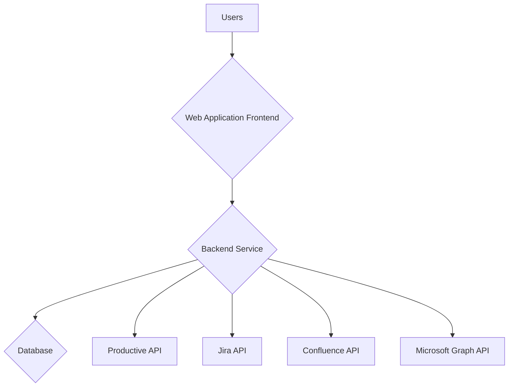

# System Architecture (Refined)

This document outlines the refined system architecture for the multi-user, multi-project setup and tracking application.

## 1. Overview

The system will be a web-based application that allows multiple users to manage their projects across different tools. It will consist of the following components:

*   **Web Application Frontend:** A user-friendly interface for project setup, status tracking, and administration.
*   **Backend Service:** A robust backend that handles user authentication, authorization, data management, and integration with third-party services.
*   **API Integration Layer:** A set of modules for interacting with the APIs of Productive, Jira, Confluence, and Microsoft Graph.
*   **Database:** A database to store user information, project data, and application settings.

## 2. High-Level Architecture Diagram

## 3. Component Descriptions

### 3.1. Web Application Frontend

The frontend will be a single-page application (SPA) built with a modern JavaScript framework like React or Vue.js. It will provide the following features:

*   **User Authentication:** Users will be able to sign up, log in, and manage their accounts.
*   **Project Dashboard:** A centralized dashboard to view and manage all projects.
*   **Project Setup Wizard:** A step-by-step guide to set up new projects, based on the questionnaire.
*   **Project Status View:** A view to track the status of each project, with data pulled from the different tools.
*   **Admin Panel:** An admin panel for managing users, and application settings.

### 3.2. Backend Service

The backend service will be a RESTful API built with a framework like Flask or Express.js. It will have the following responsibilities:

*   **User Management:** Handle user registration, authentication, and authorization.
*   **Project Management:** Manage the lifecycle of projects, from creation to completion.
*   **Data Management:** Store and retrieve data from the database.
*   **API Orchestration:** Coordinate the interactions with the different third-party APIs.
*   **Error Handling and Logging:** Implement robust error handling and logging mechanisms.

### 3.3. API Integration Layer

The API integration layer will be a set of Python modules, each responsible for interacting with a specific API. The modules will handle authentication, data mapping, and error handling for each API.

### 3.4. Database

The application will use a relational database (e.g., PostgreSQL, MySQL) to store the following data:

*   **Users:** User accounts and credentials.
*   **Projects:** Project details and settings.
*   **API Credentials:** Encrypted API credentials for the different tools.

## 4. Multi-Tenancy

The application will be designed to support multiple users and organizations. Each user will only have access to their own projects and data. This will be achieved through a combination of database schema design and application-level authorization checks.

